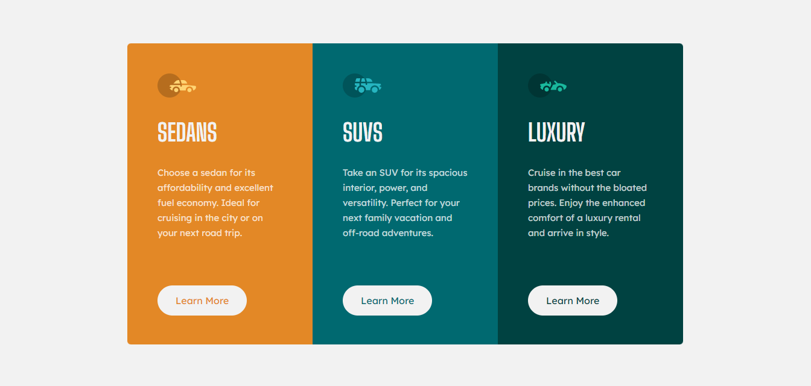

# Frontend Mentor - 3-column preview card component

Essa é a solução para o [3-column preview card component challenge on Frontend Mentor](https://www.frontendmentor.io/challenges/3column-preview-card-component-pH92eAR2-). 

Resolvi esse desafio do Frontend Mentor para aprimorar meus conhecimentos. 🚀

[]

## Tecnologias Utilizadas:
- HTML
- CSS
